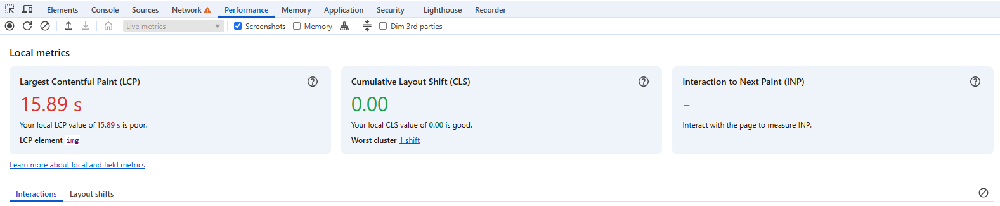
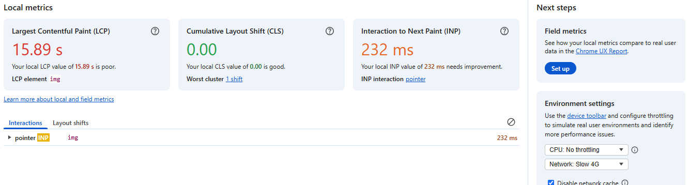
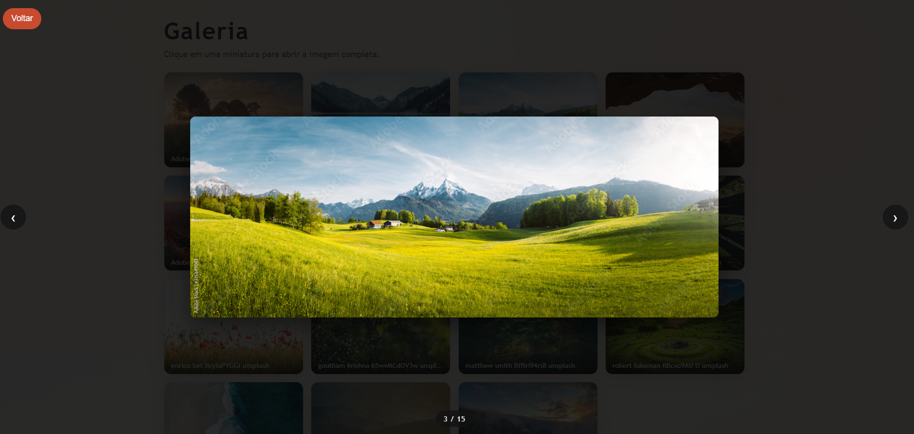
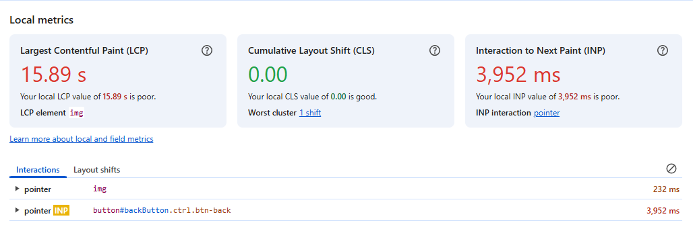
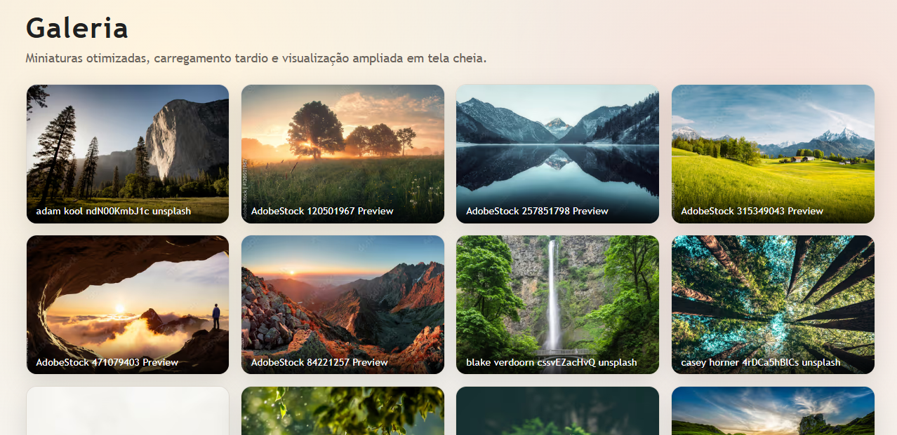
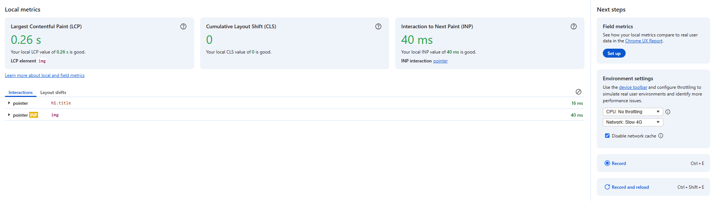
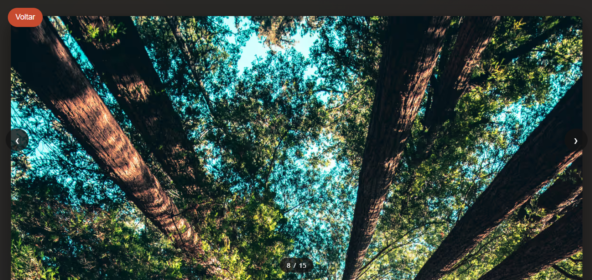
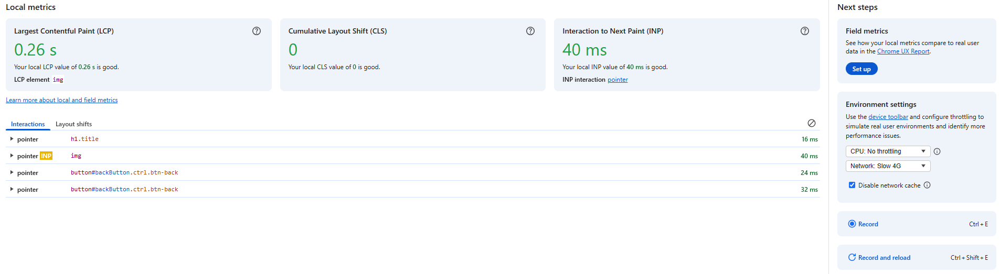

# Galeria de Imagens Otimizada

## Breve descricao do projeto

Projeto de galeria em HTML, CSS e JavaScript puro, com visualizacao de imagens em tela cheia, navegacao entre itens e foco em entrega de assets mais leves para o navegador.

O projeto agora possui uma etapa automatica de build para gerar:

- miniaturas otimizadas;
- versoes completas otimizadas em AVIF, WebP e JPG;
- arquivos minificados de CSS e JavaScript.

## Gargalos identificados

- A grade inicial carregava imagens originais pesadas direto na listagem.
- O conjunto original de imagens somava `51.039.057 bytes`.
- Havia arquivos muito grandes para uso direto no grid, incluindo imagens acima de `6 MB`, `8 MB` e uma com quase `14 MB`.
- Nao existia lazy loading nas miniaturas.
- Nao havia versoes modernas em formatos mais eficientes como WebP e AVIF.
- CSS e JavaScript eram entregues sem minificacao.

## Melhorias aplicadas

- Foi criado um pipeline com `sharp` para gerar automaticamente assets otimizados.
- Cada imagem agora gera:
  - uma miniatura otimizada para a grade;
  - uma versao completa otimizada para o visualizador;
  - formatos `AVIF`, `WebP` e fallback `JPG`.
- A grade passou a usar `picture`, permitindo que o navegador escolha o melhor formato disponivel.
- As miniaturas agora usam `loading="lazy"` e `decoding="async"`.
- Foram adicionados `width` e `height` nas imagens para reduzir salto visual no carregamento.
- O visualizador passou a abrir a versao completa otimizada, em vez do arquivo original bruto.
- O projeto ganhou build de minificacao para:
  - `style.min.css`
  - `script.min.js`
  - `gallery-data.min.js`

## Resultados medidos

- Total das imagens originais: `51.039.057 bytes`
- Total do conjunto de miniaturas geradas: `720.939 bytes`
- Total do conjunto de imagens completas otimizadas: `8.695.921 bytes`
- `style.css`: `3.813 bytes`
- `style.min.css`: `3.002 bytes`
- `script.js`: `3.125 bytes`
- `script.min.js`: `2.493 bytes`
- `gallery-data.js`: `10.329 bytes`
- `gallery-data.min.js`: `8.100 bytes`

Leitura pratica desses numeros:

- Antes, a galeria podia induzir o navegador a baixar imagens muito pesadas logo na listagem.
- Agora, a listagem usa miniaturas leves e com lazy loading.
- As imagens maiores ficaram reservadas para o momento do clique, e ainda assim em versoes otimizadas.

## Como gerar novamente os assets

Instale as dependencias:

```bash
npm install
```

Rode o build:

```bash
npm run build
```

Esse comando executa:

- geracao de imagens otimizadas em `optimized/`;
- atualizacao do manifesto `gallery-data.js`;
- minificacao de CSS e JavaScript.

## Comparativo antes/depois com prints e comentarios

### Antes
- Imagens do DevTools do navegador antes das melhorias aplicadas.
- Apenas abrindo localmente simulando uma internet 4G Lenta

- Ao expandir uma imagem


- Ao clicar no botão voltar


- O relatório está em PDF.
[Baixar Lighthouse (PDF)](relatorios/relatorio-lighthouse-antes.pdf)

### Depois
- Imagens do DevTools do navegador após aplicação das melhorias, como imagens otimizadas, minificação de css e JS, carregamento, etc.
- Apenas abrindo localmente simulando uma internet 4G Lenta

- Ao expandir uma imagem


- Ao clicar no botão voltar


- O relatório está em PDF.
[Baixar Lighthouse (PDF)](relatorios/relatorio-lighthouse-depois.pdf)

## Estrutura principal

- `index.html`: pagina da galeria usando os arquivos minificados.
- `style.css`: fonte de estilos.
- `script.js`: logica da interface.
- `gallery-data.js`: manifesto gerado automaticamente com os caminhos das imagens otimizadas.
- `tools/optimize-assets.js`: script responsavel por converter e redimensionar as imagens.
- `optimized/`: saida das miniaturas e versoes completas otimizadas.